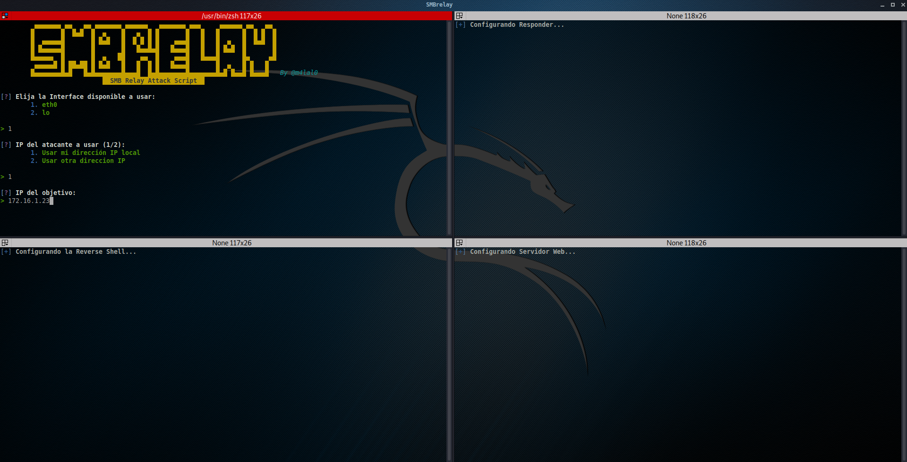

# SMB Relay Attack Script

[](#)
[](#)
[](#)
[](#)
[](#)


*** In progress *** re-writing tool to use tmux instead of terminator ***

SMBRelay is an SMB relay attack script, which automates all the steps to preform smbrelay attacks on internal pentests.

SMBRelay creates and delivers the payload leveraging the Nishang tool.

## Installation

```bash
git clone https://github.com/ITmustang/smbrelay
cd smbrelay; chmod +x smbrelay.sh
./smbrelay.sh --install
```

When you run it, it will install the dependencies and configure the Terminator terminal for correct use. The installation script works with apt (Debian) package managers.

## How do I run the tool?

To run the tool you only need to run it as follows (as root):

./smbrelay.sh



The tool will run Terminator with 4 windows.

***Top left***: Parameter configuration for using the SMB Relay attack.

***Top right***: Launch Reply on the network interface set in the configuration.

***Bottom left***: Launch of the Reverse Shell.

***Bottom right***: Launching the Nishang script to the victima computer


## Update the tool

In order to update the tool, it is necessary to run it with the **--update** or **-u** parameter, thereby verifying whether a new version exists and if it is accepted, the complete update will begin.

```
./smbrelay.sh --update
```
